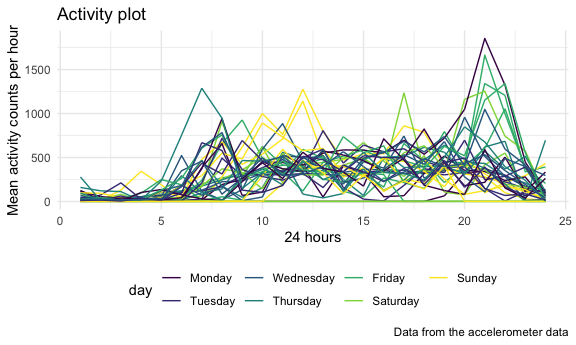
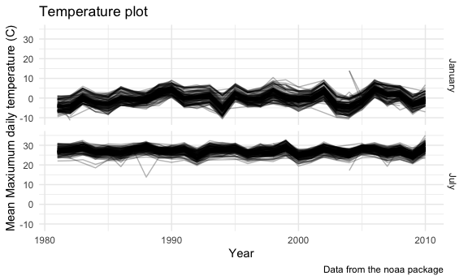
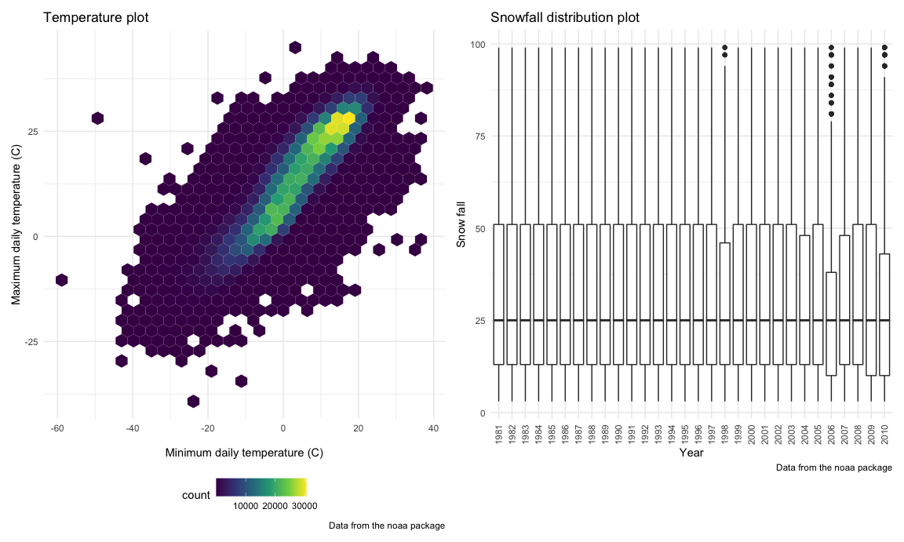

Homework 3
================
Yuqi Wang

This is my answer for HW3.

``` r
library(tidyverse)
```

    ## ── Attaching packages ─────────────────────────────────────────────────────────── tidyverse 1.3.0 ──

    ## ✓ ggplot2 3.3.2     ✓ purrr   0.3.4
    ## ✓ tibble  3.0.3     ✓ dplyr   1.0.2
    ## ✓ tidyr   1.1.2     ✓ stringr 1.4.0
    ## ✓ readr   1.3.1     ✓ forcats 0.5.0

    ## ── Conflicts ────────────────────────────────────────────────────────────── tidyverse_conflicts() ──
    ## x dplyr::filter() masks stats::filter()
    ## x dplyr::lag()    masks stats::lag()

``` r
library(p8105.datasets)
library(patchwork)
library(hexbin)

knitr::opts_chunk$set(
  fig.width = 6,
  fig.asp = .6,
  out.width = "90%"
)

theme_set(theme_minimal() + theme(legend.position = "bottom"))

options(
  ggplot2.continuous.colour = "viridis",
  ggplot2.continuous.fill = "viridis"
)

scale_colour_discrete = scale_colour_viridis_d
scale_fill_discrete = scale_fill_viridis_d
```

## Problem 1

First, load the data set.

``` r
data("instacart")
```

This dataset contains 1384617 rows and 15 columns.

Observations are the level of items in orders by users. there are
user/order variables, including user ID, order ID, order day, and order
hour. There are also item variables, including name, aisles, department,
and some numeric codes.

How many aisles and which are most items from?

``` r
count_aisle = instacart %>% 
  count(aisle) %>% 
  arrange(desc(n))
```

There are 134 aisles and fresh vegetables are most items from.

Make a plot

``` r
count_aisle %>% 
  filter(n > 10000) %>% 
  mutate(
    aisle = factor(aisle),
    aisle = fct_reorder(aisle, n)
    # this function is used to reorder aisle according to n; factor() is close to as.factor(), check with ?help.
  ) %>% 
  ggplot(aes(x = aisle, y = n)) + 
  geom_point() + 
  theme(axis.text.x = element_text(angle = 90, vjust = .5, hjust = 1))
```


Making a table showing the most popular items

``` r
instacart %>% 
  filter(aisle %in% c("baking ingredients", "dog food care", "packaged vegetables fruits")) %>% 
  group_by(aisle) %>% 
  count(product_name) %>% 
  mutate(rank = min_rank(desc(n))) %>% 
  #always use max_rank
  filter(rank < 4) %>% 
  arrange(aisle, desc(n)) %>% 
  knitr::kable()
```

| aisle                      | product\_name                                 |    n | rank |
| :------------------------- | :-------------------------------------------- | ---: | ---: |
| baking ingredients         | Light Brown Sugar                             |  499 |    1 |
| baking ingredients         | Pure Baking Soda                              |  387 |    2 |
| baking ingredients         | Cane Sugar                                    |  336 |    3 |
| dog food care              | Snack Sticks Chicken & Rice Recipe Dog Treats |   30 |    1 |
| dog food care              | Organix Chicken & Brown Rice Recipe           |   28 |    2 |
| dog food care              | Small Dog Biscuits                            |   26 |    3 |
| packaged vegetables fruits | Organic Baby Spinach                          | 9784 |    1 |
| packaged vegetables fruits | Organic Raspberries                           | 5546 |    2 |
| packaged vegetables fruits | Organic Blueberries                           | 4966 |    3 |

Apple vs ice cream.

``` r
instacart %>% 
  filter(product_name %in% c("Pink Lady Apples", "Coffee Ice Cream")) %>% 
  group_by(product_name, order_dow) %>% 
  summarize(mean_hour = mean(order_hour_of_day)) %>% 
  pivot_wider(
    names_from = order_dow,
    values_from = mean_hour
  )
```

    ## `summarise()` regrouping output by 'product_name' (override with `.groups` argument)

    ## # A tibble: 2 x 8
    ## # Groups:   product_name [2]
    ##   product_name       `0`   `1`   `2`   `3`   `4`   `5`   `6`
    ##   <chr>            <dbl> <dbl> <dbl> <dbl> <dbl> <dbl> <dbl>
    ## 1 Coffee Ice Cream  13.8  14.3  15.4  15.3  15.2  12.3  13.8
    ## 2 Pink Lady Apples  13.4  11.4  11.7  14.2  11.6  12.8  11.9

## Problem 2

First, load, tidy and wrangle the accelerometer data.

``` r
accel_df = read.csv('./data/accel_data.csv') %>% 
  janitor::clean_names() %>% 
  pivot_longer(
    activity_1:activity_1440,
    names_to = "minute",
    names_prefix = "activity.",
    values_to = "activity"
  ) %>% 
  mutate(
    day = factor(day),
    day = forcats::fct_relevel(day, c("Monday", "Tuesday", "Wednesday", "Thursday", "Friday", "Saturday", "Sunday")
  )) %>% 
  mutate(day_cat = case_when(
      day %in% c("Monday", "Tuesday", "Wednesday", "Thursday", "Friday") ~ "weekday",
      day %in% c("Saturday", "Sunday") ~ "weekend",
      TRUE ~ ""),
    minute = as.numeric(minute)) %>% 
  relocate(day_id, week, day, day_cat)
```

Description of the data set:

This data set contains 50400 rows and 6 columns. It includes the
following variables: activity, day, day\_cat, day\_id, minute, week, to
describe the activity counts for 50400 observations.

Next, we create a total activity variable for each day, and create a
table to show the totals.

``` r
accel_total_day = accel_df %>% 
  group_by(week, day) %>% 
  summarise(total_act_day = sum(activity)) %>% 
  arrange(week, day) %>% 
  pivot_wider(
    names_from = day,
    values_from = total_act_day
  ) %>% 
  knitr::kable(digit = 1)
```

    ## `summarise()` regrouping output by 'week' (override with `.groups` argument)

``` r
accel_total_day
```

| week |   Monday |  Tuesday | Wednesday | Thursday |   Friday | Saturday | Sunday |
| ---: | -------: | -------: | --------: | -------: | -------: | -------: | -----: |
|    1 |  78828.1 | 307094.2 |    340115 | 355923.6 | 480542.6 |   376254 | 631105 |
|    2 | 295431.0 | 423245.0 |    440962 | 474048.0 | 568839.0 |   607175 | 422018 |
|    3 | 685910.0 | 381507.0 |    468869 | 371230.0 | 467420.0 |   382928 | 467052 |
|    4 | 409450.0 | 319568.0 |    434460 | 340291.0 | 154049.0 |     1440 | 260617 |
|    5 | 389080.0 | 367824.0 |    445366 | 549658.0 | 620860.0 |     1440 | 138421 |

From the table we built for the totals, we found that generally
speaking, this participant tended to have more activity on Fridays.
Also, on Saturdays, there are two days with summed activity counts of
1440, which are suspicious numbers because 1440 means the person has an
activity count of 1 for every minute on the two days, indicating that
this person might have taken off the device on the two days.

``` r
accel_df %>% 
  mutate(
    hour = ceiling(minute/60)
  ) %>% 
  group_by(day_id, hour) %>% 
  mutate(mean_act = mean(activity)) %>% 
  ggplot(aes(x = hour, y = mean_act, color = day, group = day_id)) +
  geom_line() +
  labs(
    title = "Activity plot",
    x = "24 hours",
    y = "Mean activity counts per hour",
    caption = "Data from the accelerometer data"
  )
```



Description of the trend: According to the graph, the participant tends
to have more activity from 5am to 1pm and from 6pm to 9pm. On Fridays,
the person tend to have more activities in the evening, while on
Sundays, the person has more activity at daytime. the highest average
activity count is on Monday.

## Problem 3

First, load the ny\_noaa data set and do data cleaning about it.

``` r
data("ny_noaa")
noaa_df = ny_noaa %>% 
  separate(date, c("year", "month", "day"), "-") %>% 
  mutate(year = as.integer(year),
         month = as.integer(month),
         day = as.integer(day)) %>%
  mutate(tmax = as.numeric(tmax),
         tmin = as.numeric(tmin),
         month = month.name[month]) %>% 
  mutate(tmax = tmax/10,
         tmin = tmin/10,
         prcp = prcp/10)
```

Description of the dataset:

This data set contains 2595176 rows and 9 columns. It includes the
following variables: day, id, month, prcp, snow, snwd, tmax, tmin, year,
to describe the information of weather collected for 2595176
observations. There are many missing values for `tmax` and `tmin`, but
the data analysis is not affected.

Next, check what are the most commonly observed values for snowfall.

``` r
noaa_df %>% 
  count(snow, name = "snow_num") %>% 
  mutate(rank = min_rank(desc(snow_num))) %>% 
  arrange(rank)
```

    ## # A tibble: 282 x 3
    ##     snow snow_num  rank
    ##    <int>    <int> <int>
    ##  1     0  2008508     1
    ##  2    NA   381221     2
    ##  3    25    31022     3
    ##  4    13    23095     4
    ##  5    51    18274     5
    ##  6    76    10173     6
    ##  7     8     9962     7
    ##  8     5     9748     8
    ##  9    38     9197     9
    ## 10     3     8790    10
    ## # … with 272 more rows

For snowfall, 0 is the most commonly observed value, because for most
days in a year, there is no snowfall.

Make a two-panel plot showing the average max temperature in January and
in July in each station across years

``` r
noaa_df %>% 
  filter(month == c("January", "July")) %>% 
  group_by(id, month, year) %>% 
  summarize(tmax_mean = mean(tmax, na.rm = TRUE)) %>% 
  ggplot(aes(x = year, y = tmax_mean, group = id)) +
  geom_line(alpha = 0.3) +
  facet_grid(month ~ .) +
  labs(
    title = "Temperature plot",
    x = "Year",
    y = "Mean Maxiumum daily temperature (C)",
    caption = "Data from the noaa package"
 )
```

    ## `summarise()` regrouping output by 'id', 'month' (override with `.groups` argument)

    ## Warning: Removed 5641 row(s) containing missing values (geom_path).



Description of trend:

According to the graph, the mean max temperatures for January and July
show a fluctuant trend from 1980 to 2010. The max temperature in
Januarys shows a slight increasing trend, which may indicate global
warming, while the max temperature in Julys are relatively stable. The
difference of max temperature measures among all the stations is about
10 degree Celsius.

There are several outliers in the two graphs. In the graph of January,
there is a extremely high outlier with max temperature of 13 degress
Celsius. In July, there are two outliers with low temperature of 14 and
17.

Make a two-panel plot showing (i) tmax vs tmin for the full dataset
(note that a scatterplot may not be the best option); and (ii) make a
plot showing the distribution of snowfall values greater than 0 and less
than 100 separately by year.

``` r
tmax_min_p = noaa_df %>% 
  na.omit(tmax,tmin) %>% 
  ggplot(aes(x = tmin, y = tmax)) +
  geom_hex() +
  labs(
    title = "Temperature plot",
    x = "Minimum daily temperature (C)",
    y = "Maximum daily temperature (C)",
    caption = "Data from the noaa package"
 )

snowfall_df = noaa_df %>% 
  filter(0 < snow, snow < 100) %>% 
  group_by(year) %>% 
  select(year, snow) %>% 
  mutate(year = as.character(year)) %>% 
  ggplot(aes(x = year, y = snow)) +
  geom_boxplot() +  
  theme(axis.text.x = element_text(angle = 90, vjust = .5, hjust = 1)) +
  labs(
    title = "Snowfall distribution plot",
    x = "Year",
    y = "Snow fall",
    caption = "Data from the noaa package"
 )

tmax_min_p + snowfall_df
```


